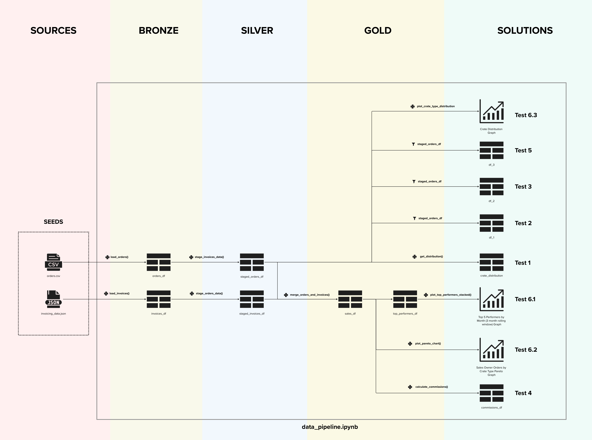

# IFCO Data Engineering Test Solution

This is a solution to the IFCO data engineering test avaliable [here](https://github.com/Digital-IFCO/data-engineering-test).

## Project Structure

- `data_pipeline.ipynb`: Jupyter Notebook containing the main code for the project. It includes data processing steps, unit testing, analysis, and visualizations.
- `Dockerfile`: Contains instructions to build the Docker image with all necessary dependencies.
- `docker-compose.yml`: Used for setting up and running the environment in Docker.
- `requirements.txt`: Lists the Python packages required to run the project.

## Deliverables

This project provides a complete and reproducible execution environment. The deliverables include:

1. **Source Code**: All test answers are located in the `data_pipeline.ipynb` Jupyter Notebook.
2. **Execution Environment**: A Docker-based setup for easy deployment and replication.
3. **Documentation**: This README with detailed instructions for setup, configuration, and usage.

## Prerequisites

- Docker and Docker Compose are required to build and run the project in a containerized environment. You can visit https://docs.docker.com/desktop/install/windows-install/ for more information on how to install docker.

## Setup Instructions

### Step 1: Clone the Repository

First, clone the repository by running:

```bash
git clone https://github.com/alecab94/data-engineering-test.git
```

### Step 2: Navitage to the solution directory

```bash
cd data-engineering-test/solution/
```

### Step 3: Build the Docker Image

From the solution directory, run:

```bash
docker-compose up --build
```

This will create a Docker container with the specified environment and dependencies.

### Step 4: Run the Project

Once the container is up, you can access the notebook via the JupyterLab interface by opening [http://localhost:8888](http://localhost:8888) in your browser.
There, you will find the project files. Open `data_pipeline.ipynb` located in `solution\` and run the cells to test the results.

## Usage

- Run each cell in the Jupyter Notebook `data_pipeline.ipynb` to reproduce the data processing steps and results.

## Entity Relationship Diagram

To take a closer look at the ERD, please open the file `erd.pdf`

<br />

<p align="center">
  
</p>

<br />
